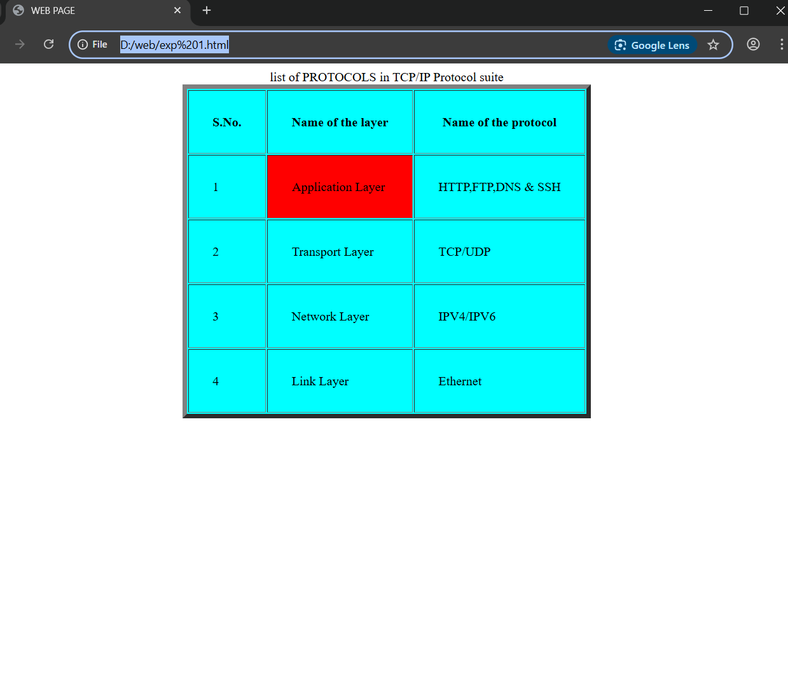

# EX01 Developing a Simple Webserver
## Date: 25/08/2025
## Name: RAGUL K R 
## Reg.No: 212224240123

## AIM:
To develop a simple webserver to serve html pages and display the list of protocols in TCP/IP Protocol Suite.

## DESIGN STEPS:
### Step 1: 
HTML content creation.

### Step 2:
Design of webserver workflow.

### Step 3:
Implementation using Python code.

### Step 4:
Import the necessary modules.

### Step 5:
Define a custom request handler.

### Step 6:
Start an HTTP server on a specific port.

### Step 7:
Run the Python script to serve web pages.

### Step 8:
Serve the HTML pages.

### Step 9:
Start the server script and check for errors.

### Step 10:
Open a browser and navigate to http://127.0.0.1:8000 (or the assigned port).

## PROGRAM:
<!doctype html>
<html>
<head> <title> WEB PAGE </title>
</head>
<body>
    <table align="center" border="6" bgcolor="aqua"cellpadding="30">
        <caption>list of PROTOCOLS in TCP/IP Protocol suite</caption>
        <tr><th>S.No.</th><th>Name of the layer</th><th>Name of the protocol</th></tr>
        <tr><td>1</td><td bgcolor="red">Application Layer</td><td>HTTP,FTP,DNS & SSH</td></tr>
        <tr><td>2</td><td>Transport Layer</td><td>TCP/UDP</td></tr>
        <tr><td>3</td><td>Network Layer</td><td>IPV4/IPV6</td></tr>
        <tr><td>4</td><td>Link Layer</td><td>Ethernet</td></tr>
    </table>
    

</body>

## OUTPUT:

## RESULT:
The program for implementing simple webserver is executed successfully.
